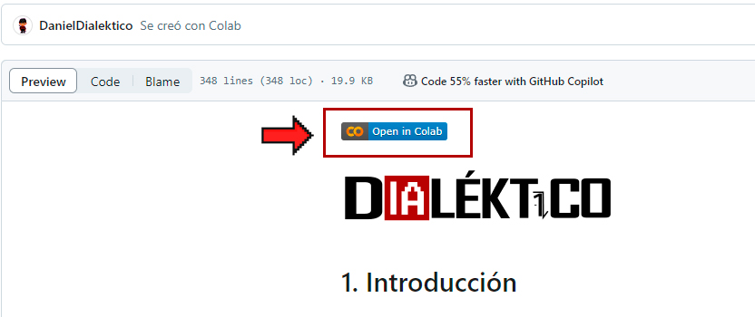

# Prácticas de Machine Learning
En este repositorio se encuentran todas las **prácticas de machine learning** en Python y en español utilizadas en el curso gratuito de aprendizaje de máquinas de **dialektico.com**, al cual se puede acceder en la siguiente URL:
https://dialektico.com/cursoml/

  

  

## ¿Cómo utilizar?
Cada práctica está organizada en carpetas que indican el tema abordado, donde yacen los códigos en libretas de **Google Colab**, por lo que para utilizarlas solo es necesario acceder dando clic a la leyenda "Open in Colab" en la parte superior: 

  

  

También se puede acceder a las URLs directas para el uso de los notebooks en la siguiente página: https://dialektico.com/laboratorio/

## Más información
Todas las libretas son de mi autoría, incluyendo los análisis, textos, código, imágenes, y estructuración de modelos de aprendizaje automático, así como la obtención de algunos conjuntos de datos. Cualquier elemento obtenido de forma externa está debidamente referenciado.

El uso de estas libretas para aprendizaje personal es libre.

Para más información, visita https://dialektico.com/

Para contacto directo: contacto@dialektico.com
